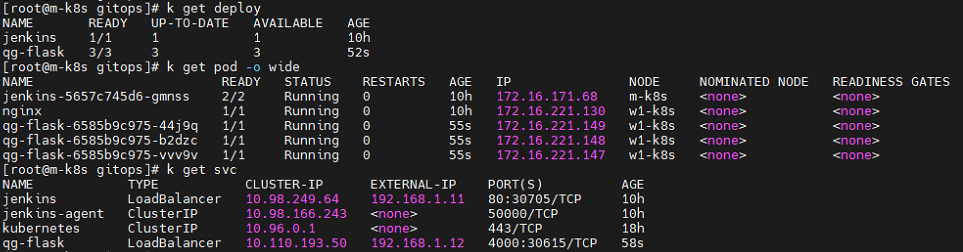

# GitOps
- CI/CD implementation using Jenkins pipeline on Kubernetes cluster
- GitOps implementation using Poll SCM in Jenkins
- Slack alarms when deployed
- Deploy a Flask API of question generation App using Kubernetes LoadBalancer Service

<br/>

## Question Generation App [*(sample in and out)*](#1)
The question generation App generates questions using description and keywords. The AI model understands context of the text description and generates questions related to each keyword. The model is wrapped to Flask API which listens on port *4000*, and route path of *qg_bart*. <br/>
The model is fine-tuned using *Facebook AI's BART architecture* with *KorQuAD dataset* and pushed in docker-hub *mj0098/qg-bart:1.2*.

<br/>

## How to run
1. Prerequisites
- Jenkins on Kubernetes cluster
- MetalLB : open-source bare metal load-balancer for kubernetes
- Slack with Jenkins CI App
- `GitHub repository` for GitOps

2. Generate Jenkins Pipeline item
- set *Poll SCM* to monitor `GitHub repository` modification
    - cron job for every 10 minutes (*/10 * * * *)
- set *pipeline script from SCM* with `GitHub repository`


3. Test autonomous deploy when modifying `GitHub repository`
    ```shell
    sed -i 's/replicas: 1/replicas: 3/' qg-flask.yaml
    ```
4. Check Slack alarms
5. Test Kubernetes Service exposes Flask App correctly

<br/>

## Results
- After initial pipeline run


- After scale up replicas pushed in GitHub repository (**GitOps** auto deploy)


- Jenkins result


- Slack Alarms result


<br/>

- <a id="1">Question Generation App exposed by kubernetes service</a> *(external-ip : 192.168.1.12 , port : 4000)*
    - console output using *curl* request
     <br/>

    - ***POSTMAN*** output

    

<br/>

---

### References

<a id="1">[1]</a> https://github.com/sysnet4admin/_Book_k8sInfra
